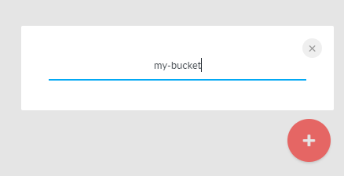
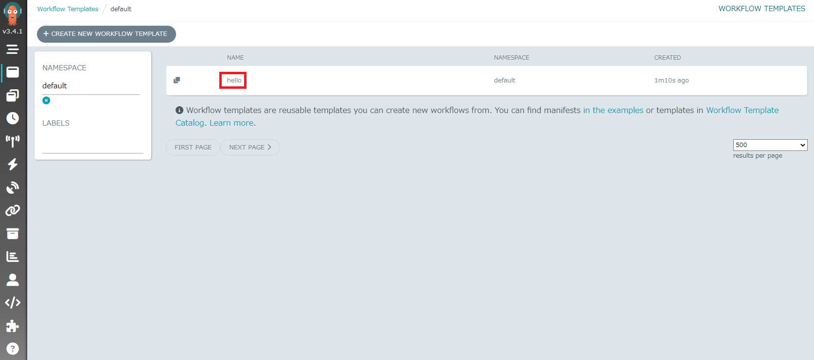

# Oracle Hangout Cafe Season 6 #3 Workflows

セッション時に使用したデモ環境の構築手順および資材置き場です。

# Argo Workflows Set Up

## 1.Argo Workflows Install

デモ環境は、Helm でインストールを実施したので、その手順となります。

事前に Helm クライアントをインストールが必要となります。

Oracle Cloud Infrastructure(OCI) の場合は、Cloud Shell を利用することで Helm クライアントのインストールは不要です。

```sh
helm repo add argo https://argoproj.github.io/argo-helm
```

```sh
helm install --create-namespace --namespace argo argo-workflows argo/argo-workflows
```
```sh
NAME: argo-workflows
LAST DEPLOYED: Fri Oct 14 05:45:33 2022
NAMESPACE: argo
STATUS: deployed
REVISION: 1
TEST SUITE: None
NOTES:
1. Get Argo Server external IP/domain by running:

kubectl --namespace argo get services -o wide | grep argo-workflows-server

2. Submit the hello-world workflow by running:

argo submit https://raw.githubusercontent.com/argoproj/argo-workflows/master/examples/hello-world.yaml --watch
```

[Argo Workflows Chart] (https://github.com/argoproj/argo-helm/tree/main/charts/argo-workflows)

argo-workflows-server と argo-workflows-workflow-controller の Pod が Running であることを確認します。

```sh
kubectl get pods -n argo
```
```sh
NAME                                                  READY   STATUS    RESTARTS   AGE
argo-workflows-server-6498c4c886-f8g24                1/1     Running   0          4m4s
argo-workflows-workflow-controller-8674b6b66d-26ks4   1/1     Running   0          4m4s
```

argo workflows のインストールは完了です。

## 2.Argo Workflows UI Access

デモ環境では、Service としてインストールされる argo-workflow-service の type を LoadBalancer に変更して、
ブラウザからアクセスできるようにします。

```sh
kubectl edit service/argo-workflows-server -n argo
```
```sh
・
・ ＜省略＞
・
  selector:
    app.kubernetes.io/instance: argo-workflows
    app.kubernetes.io/name: argo-workflows-server
  sessionAffinity: None
  type: ClusterIP # type: LoadBalancer に変更
・
・ ＜省略＞
・
```

EXTERNAL-IP を確認

```sh
kubectl get services -n argo
```
```sh
NAME                    TYPE           CLUSTER-IP      EXTERNAL-IP       PORT(S)          AGE
argo-workflows-server   LoadBalancer   10.96.147.139   193.xxx.xxx.xxx   2746:31787/TCP   24m
```

ブラウザを起動して、UI にアクセスします。

http://193.xxx.xxx.xxx:2746/


Token を取得して、ログインします。

argo-workflows-server Podのコンテナから argo auth token コマンドを実行して Token を取得します。

argo-workflows-server の Pod 名を確認します。

```sh
kubectl get pods -n argo
```
```sh
NAME                                                  READY   STATUS    RESTARTS   AGE
argo-workflows-server-6498c4c886-f8g24                1/1     Running   0          36m
argo-workflows-workflow-controller-8674b6b66d-26ks4   1/1     Running   0          36m
```

```sh
kubectl exec -it argo-workflows-server-6498c4c886-f8g24 -n argo -- argo auth token
```
```sh
Bearer eyJ...
```

Bearer を含めて、ログイン画面内で入力して、ログインボタンをクリックします。


ログイン完了です。


# Sample Workflow

本リポジトリの manifests 内にワークフローのマニフェストファイルは格納されています。

本リポジトリからクローンしてご利用ください。

```sh
git clone https://github.com/oracle-japan/ochacafe-s6-3.git
```

## 1.Basic

whalesay コンテナイメージを利用したサンプルワークフローを実行してみます。

```sh
kubectl create -f ochacafe-s6-3/manifests/sample-workflows.yaml
```
```sh
workflow.argoproj.io/steps-48wz6 created
```

UI を利用します。 default ネームスペースを指定すると 実行および実行中のワークフローがリスト表示されます。

対象のワークフロー名をクリックして状況を確認します。


ワークフローの結果を確認できます。


さらにログボタンをクリックして、実行結果を確認します。


以降も kubectl create -f を実行して、UI で確認する手順は同じなので、実行してみましょう。

## 2.並列処理

並列処理を実行します。

```sh
kubectl create -f ochacafe-s6-3/manifests/sample-workflows-parallel.yaml
```
```sh
workflow.argoproj.io/steps-kmbvc created
```


## 3.Directed Acyclic Graph (DAG)

並列処理を DAG 形式で記述して実行します。

```sh
kubectl create -f ochacafe-s6-3/manifests/sample-workflows-dag.yaml
```
```sh
workflow.argoproj.io/steps-7r4c6 created
```


## 4.Script

script を利用したワークフローを実行します。

```sh
kubectl create -f ochacafe-s6-3/manifests/script-workflows.yaml
```
```sh
workflow.argoproj.io/script-template-6wdvt created
```


Python スクリプトにより、以下表示されます。

Oracle Cloud Hangout Cafe 


## 5.Kubernetes Resource

resource を利用したワークフローを実行します。

初めに default ネームスペースに wf-sa という Service Account を作成します。

```sh
kubectl create sa wf-sa
```
```sh
serviceaccount/wf-sa created
```

role と rolebinding を適用します。

```sh
kubectl apply -f ochacafe-s6-3/manifests/role.yaml
```
```sh
role.rbac.authorization.k8s.io/wf-sa created
```

```sh
kubectl apply -f ochacafe-s6-3/manifests/rolebinding.yaml
```
```sh
rolebinding.rbac.authorization.k8s.io/wf-sa created
```

ワークフローを実行します。

```sh
kubectl create -f ochacafe-s6-3/manifests/resource-workflows.yaml
```
```sh
workflow.argoproj.io/resource-template-28h9s created
```


sample-cm という ConfigMap が作成されていることが分かります。


## 6.Retry

トータルで6回実行して、すべて失敗するワークフローを実行します。

```sh
kubectl create -f ochacafe-s6-3/manifests/retry-workflows.yaml
```
```sh
workflow.argoproj.io/retry-container-4lchw created
```


次に以下の設定をしたワークフローを実行します。
結果は失敗となります。

- backoff を利用して、リトライ間隔、リトライ時間を指定可能
- duration 10秒待つ,20秒待つ,40秒待つ...（factor で何倍するのかを指定）
- maxDuration が “1m” 1分（60秒）なので、limitで5回でも2回のリトライで終了

```sh
kubectl create -f ochacafe-s6-3/manifests/retry-advance-workflows.yaml
```
```sh
workflow.argoproj.io/retry-container-rckjn created
```


## 7.処理の継続

一つの処理が失敗しても、後続の処理を実行するワークフローを実行します。

```sh
kubectl create -f ochacafe-s6-3/manifests/continue-workflows.yaml
```
```sh
workflow.argoproj.io/continue-on-fail-hf8k2 created
```


## 8.Suspend & Delay

suspend を利用して、確認後、処理を継続するワークフローを実行します。

delay も利用しているので、確認処理を実行しなくても、20秒後には処理が完了します。

```sh
kubectl create -f ochacafe-s6-3/manifests/suspend-workflows.yaml
```
```sh
workflow.argoproj.io/continue-on-fail-hf8k2 created
```

approve をクリックします。


RESUME ボタンをクリックします。


OK ボタンをクリックします。


全ての処理が完了となります。


## 9.artifact

artifact を利用して、GitHub からソースを取ってきます。

[argo workflows repository](https://github.com/argoproj/argo-workflows) のソースとなります。

```sh
kubectl create -f ochacafe-s6-3/manifests/artifact-workflows.yaml
```
```sh
workflow.argoproj.io/input-artifact-git-p5w6b created
```


## 10.ファイルの受け渡し

MinIOを利用して、ファイルの受け渡しをするワークフローを実行します。

MinIOをインストールします。

```sh
helm repo add minio https://helm.min.io/
```
```sh
helm repo update
```
```sh
helm install argo-artifacts minio/minio --set service.type=LoadBalancer --set fullnameOverride=argo-artifacts
```
```sh
NAME: argo-artifacts
LAST DEPLOYED: Fri Oct 14 08:33:02 2022
NAMESPACE: default
STATUS: deployed
REVISION: 1
TEST SUITE: None
NOTES:
Minio can be accessed via port 9000 on an external IP address. Get the service external IP address by:
kubectl get svc --namespace default -l app=argo-artifacts

Note that the public IP may take a couple of minutes to be available.

You can now access Minio server on http://<External-IP>:9000. Follow the below steps to connect to Minio server with mc client:

  1. Download the Minio mc client - https://docs.minio.io/docs/minio-client-quickstart-guide

  2. Get the ACCESS_KEY=$(kubectl get secret argo-artifacts --namespace default -o jsonpath="{.data.accesskey}" | base64 --decode) and the SECRET_KEY=$(kubectl get secret argo-artifacts --namespace default -o jsonpath="{.data.secretkey}" | base64 --decode)
  3. mc alias set argo-artifacts http://<External-IP>:9000 "$ACCESS_KEY" "$SECRET_KEY" --api s3v4

  4. mc ls argo-artifacts

Alternately, you can use your browser or the Minio SDK to access the server - https://docs.minio.io/categories/17
```

MinIO の UI ログインに必要となるアクセスキーとシークレットキーを取得します。

アクセスキー

```sh
kubectl get secret argo-artifacts -o jsonpath='{.data.accesskey}' | base64 --decode
```
```sh
3u...
```

シークレットキー

```sh
kubectl get secret argo-artifacts -o jsonpath='{.data.secretkey}' | base64 --decode
```
```sh
tm...
```

ブラウザでアクセスする UI の EXTERNAL-IP を確認します。

```sh
kubectl get service argo-artifacts
```
```sh
NAME             TYPE           CLUSTER-IP      EXTERNAL-IP       PORT(S)          AGE
argo-artifacts   LoadBalancer   10.xxx.xxx.xxx   193.123.229.121   9000:31901/TCP   8m19s
```

ブラウザを起動してアクセスします。

http://10.xxx.xxx.xxx:9000/

アクセスキーとシークレットキーを入力してログインします。


ログイン完了です。


赤×ボタンをクリック後、create bucket ボタンをクリックします。


my-bucket と入力して Enter キーを押します。



my-bucket が作成されます。


ConfigMap を作成します。

```sh
kubectl apply -f ochacafe-s6-3/manifests/artifact-repo-cm.yaml
```
```sh
configmap/artifact-repo created
```

MinIO を利用してファイルの受け渡しを処理するワークフローを実行します。

```sh
kubectl create -f ochacafe-s6-3/manifests/minio-workflows.yaml
```
```sh
workflow.argoproj.io/artifact-passing-mmmrj created
```


処理が成功すると、MinIO の my-bucket にファイルが格納されていることを確認できます。


volumeClaimTemplates については、Demo 内容で実施します。

## 11.WorkflowTemplate

WorkflowTemplate を利用して、テンプレート化を実施します。

WorkflowTemplate を登録します。

```sh
kubectl create -f ochacafe-s6-3/manifests/workflow-template.yaml
```
```sh
workflowtemplate.argoproj.io/hello created
```

テンプレート一覧に表示されます。



Workflow を実行します。

```sh
kubectl create -f ochacafe-s6-3/manifests/workflow-template-o.yaml
```
```sh
workflow.argoproj.io/from-template created
```

テンプレートを呼び出して、実行したワークフローが成功しています。


# Argo Workflows Demo

GitHub + OKE + DockerHub

デモの環境概要


GitHub からソースコードをクローンして、go のサンプルアプリケーションをビルドします。その後、コンテナイメージのビルド処理を実行して、DockerHub にコンテナイメージを格納するというワークフローのデモです。

事前準備として、DockerHub のアカウントを作成して、リポジトリを作成しておきます。

DockerHub の認証情報を Secret に登録しておきます。

```sh
kubectl create secret generic docker-config --from-literal="config.json={\"auths\": {\"https://index.docker.io/v1/\": {\"auth\": \"$(echo -n ＜Your-Repository-name＞:＜Your-Token＞|base64)\"}}}"
```
```sh
secret/docker-config created
```

ワークフローを実行します。

```sh
kubectl create -f ochacafe-s6-3/manifests/dev-workflows.yaml
```
```sh
workflow.argoproj.io/buildkit created
```

処理が成功します。


DockerHub にイメージが格納されます。


# Airflow Set Up

## 1.Airflow Install

デモ環境は、Helm でインストールを実施したので、その手順となります。

```sh
helm repo add apache-airflow https://airflow.apache.org
```

```sh
helm repo update
```

```sh
helm install airflow apache-airflow/airflow --create-namespace --namespace airflow
```
```sh
NAME: airflow
LAST DEPLOYED: Sun Oct 16 13:30:17 2022
NAMESPACE: airflow
STATUS: deployed
REVISION: 1
TEST SUITE: None
NOTES:
Thank you for installing Apache Airflow 2.4.1!

Your release is named airflow.
You can now access your dashboard(s) by executing the following command(s) and visiting the corresponding port at localhost in your browser:

Airflow Webserver:     kubectl port-forward svc/airflow-webserver 8080:8080 --namespace airflow
Default Webserver (Airflow UI) Login credentials:
    username: admin
    password: admin
Default Postgres connection credentials:
    username: postgres
    password: postgres
    port: 5432

You can get Fernet Key value by running the following:

    echo Fernet Key: $(kubectl get secret --namespace airflow airflow-fernet-key -o jsonpath="{.data.fernet-key}" | base64 --decode)

###########################################################
#  WARNING: You should set a static webserver secret key  #
###########################################################

You are using a dynamically generated webserver secret key, which can lead to
unnecessary restarts of your Airflow components.

Information on how to set a static webserver secret key can be found here:
https://airflow.apache.org/docs/helm-chart/stable/production-guide.html#webserver-secret-key
```

7個の Pod が Running であることを確認します。

```sh
kubectl get pods -n airflow
```
```sh
NAME                                 READY   STATUS    RESTARTS   AGE
airflow-postgresql-0                 1/1     Running   0          2m46s
airflow-redis-0                      1/1     Running   0          2m46s
airflow-scheduler-5754fc7746-cdkvb   2/2     Running   0          2m47s
airflow-statsd-5b4964646f-nqqzc      1/1     Running   0          2m47s
airflow-triggerer-7795dfffcb-ln22d   1/1     Running   0          2m47s
airflow-webserver-7bf76fd7fc-qccj5   1/1     Running   0          2m47s
airflow-worker-0                     2/2     Running   0          2m46s
```

## 2.Airflow UI Access

デモ環境では、Service としてインストールされる argo-workflow-service の type を LoadBalancer に変更して、
ブラウザからアクセスできるようにします。

```sh
kubectl edit service/airflow-webserver -n airflow
```
```sh
・
・ ＜省略＞
・
  selector:
    component: webserver
    release: airflow
    tier: airflow
  sessionAffinity: None
  type: ClusterIP # type: LoadBalancer に変更
・
・ ＜省略＞
・
```

EXTERNAL-IP を確認

```sh
kubectl get service airflow-webserver -n airflow
```
```sh
NAME                TYPE           CLUSTER-IP      EXTERNAL-IP       PORT(S)          AGE
airflow-webserver   LoadBalancer   10.96.110.188   144.xxx.xxx.xxx   8080:31703/TCP   4h5m
```

ブラウザを起動して、UI にアクセスします。

http://144.xxx.xxx.xxx:8080/


Default Username : admin  
Default Password : admin

ログイン完了です。

